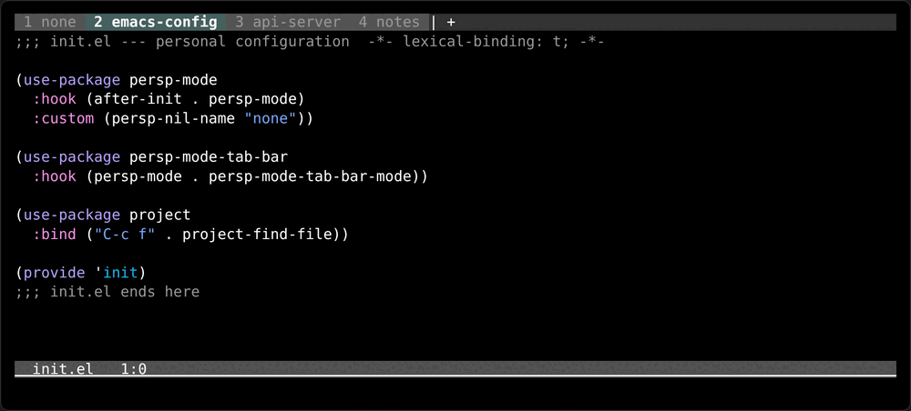
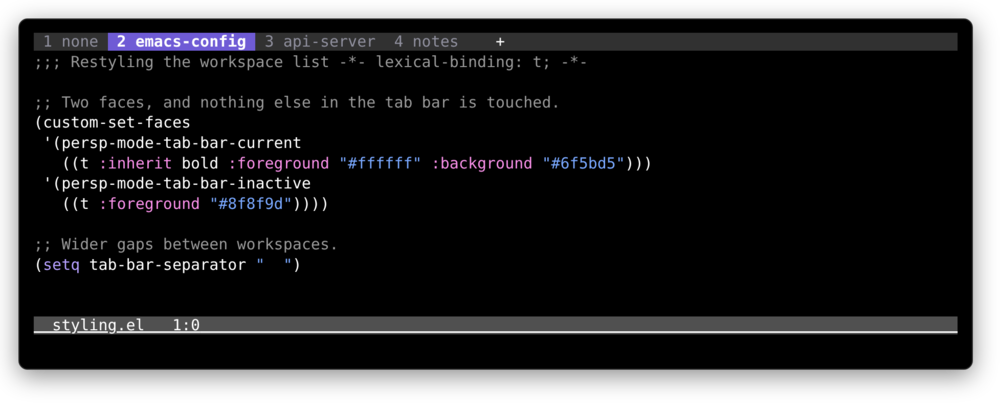

# persp-mode-tab-bar

[](https://github.com/Jotham-LEC/persp-mode-tab-bar/actions/workflows/ci.yml)
[](https://github.com/Jotham-LEC/persp-mode-tab-bar/blob/main/LICENSE)

> Basically a tab bar for [persp-mode](https://github.com/Bad-ptr/persp-mode.el) workspaces
> Works with Doom Emacs's `+workspace` commands and with plain persp-mode.

In original persp-mode, it tells you which workspace you are in by echoing the list when you switch, and a message disappears a moment later. But what if...I want to see it perpetually? Built for emacs users who prefer using buffers over tabs, but still want some high-level organisation. (Tmux session equivalent?)



## Install

Not on MELPA yet. With `use-package` and Emacs 30's `:vc`:

```elisp
(use-package persp-mode-tab-bar
  :vc (:url "https://github.com/Jotham-LEC/persp-mode-tab-bar" :rev :newest)
  :hook (persp-mode . persp-mode-tab-bar-mode))
```

Or with [straight.el](https://github.com/radian-software/straight.el):

```elisp
(straight-use-package
 '(persp-mode-tab-bar :type git :host github :repo "Jotham-LEC/persp-mode-tab-bar"))
```

Or Doom, in `packages.el`:

```elisp
(package! persp-mode-tab-bar
  :recipe (:host github :repo "Jotham-LEC/persp-mode-tab-bar"))
```

Emacs 29.1 or newer, and persp-mode.

## Use

```elisp
(persp-mode-tab-bar-mode 1)
```

In Doom, where `:ui workspaces` gives you persp-mode already, the mode detects the `+workspace` commands and uses them, so the numbering and the order match what `SPC TAB .` displays. It also silences Doom's echoed workspace list, since the bar is now saying the same thing permanently. Set `persp-mode-tab-bar-silence-doom-echo` to `nil` if you want both. Doom's `:ui tabs` is centaur-tabs, which tabs buffers — the two do not overlap.

## Customising

| Face                          | Default                           | Draws                    |
| ----------------------------- | --------------------------------- | ------------------------ |
| `persp-mode-tab-bar-current`  | `bold` + `highlight`              | the workspace you are in |
| `persp-mode-tab-bar-inactive` | `shadow` + `tab-bar-tab-inactive` | every other workspace    |

Both defaults are compositions of stock faces, so the list follows whatever theme you load. To override, set them the way you set any other face — `custom-set-faces`, or `:custom-face` in a `use-package` block, or `M-x customize-face`:

```elisp
(custom-set-faces
 '(persp-mode-tab-bar-current
   ((t :inherit bold :foreground "#ffffff" :background "#6f5bd5")))
 '(persp-mode-tab-bar-inactive
   ((t :foreground "#8f8f9d"))))

(setq tab-bar-separator "  ")
```



The spacing around a name is the tab bar's, not this package's: `tab-bar-separator` sets what goes between the items, and on a GUI frame a `:box` on either face pads and outlines them.

| Variable                               | Default                   | Does                                                                         |
| -------------------------------------- | ------------------------- | ---------------------------------------------------------------------------- |
| `persp-mode-tab-bar-backend`           | `auto`                    | pins the workspace API — `doom` or `persp-mode` — instead of detecting it    |
| `persp-mode-tab-bar-replace`           | the two tab-drawing items | which `tab-bar-format` items the workspace list stands in for                |
| `persp-mode-tab-bar-silence-doom-echo` | `t`                       | drops Doom's echoed workspace list, which the bar is now showing permanently |

## Compatibility

The mode contributes one `tab-bar-format` item rather than taking the bar. It splices the workspace list in where the real tabs were and leaves every other item where it found it, so history buttons, `tab-bar-format-global` and packages like [tab-bar-echo-area](https://github.com/fritzgrabo/tab-bar-echo-area) or [tab-bar-notch](https://github.com/jdtsmith/tab-bar-notch) go on working; turning the mode off puts the format back, and `tab-bar-show` with it. Its own two faces leave themes and [vim-tab-bar](https://github.com/jamescherti/vim-tab-bar.el) alone, and its `workspace-N` item keys collide with none of Emacs's. Real tab-bar tabs, Doom's per-workspace tab sets included, keep working — they are simply not drawn.

## Contributing

It is a small package and a personal one. Bug reports and pull requests are welcome.

```sh
make deps                # persp-mode and package-lint, into ./.deps
make compile lint test   # byte-compile clean, checkdoc, package-lint, ERT
```

CI runs the same on Emacs 29 and 30.

## License

GPL-3.0-or-later.
