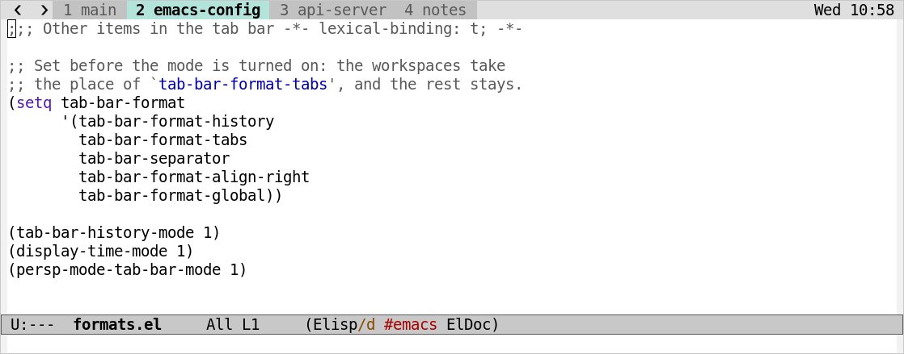

# persp-mode-tab-bar

[](https://github.com/Jotham-LEC/persp-mode-tab-bar/actions/workflows/ci.yml)
[](https://github.com/Jotham-LEC/persp-mode-tab-bar/blob/main/LICENSE)

persp-mode-tab-bar shows the workspaces of
[persp-mode](https://github.com/Bad-ptr/persp-mode.el) in the tab bar (see
[Tab Bars](https://www.gnu.org/software/emacs/manual/html_node/emacs/Tab-Bars.html)
in The GNU Emacs Manual). Each workspace is drawn as a numbered item, the
current one is picked out, and clicking one switches to it. It works with
Doom Emacs's `+workspace` commands and with plain persp-mode.


persp-mode tells you which workspace you are in only by echoing the list of
workspaces when you switch, and the message is gone a moment later.
persp-mode-tab-bar keeps that list on screen. It is meant for those who use
persp-mode already, most of all through Doom's `:ui workspaces` module.

## Installation

persp-mode-tab-bar requires Emacs 29.1 or later, and persp-mode 3.0.8 or
later.

It is not yet available from MELPA. To install it from its Git repository
with `use-package` (Emacs 30 or later), turning the mode on and off with
persp-mode:

```elisp
(use-package persp-mode-tab-bar
  :vc (:url "https://github.com/Jotham-LEC/persp-mode-tab-bar" :rev :newest)
  :hook (persp-mode . (lambda () (persp-mode-tab-bar-mode (if persp-mode 1 -1)))))
```

With [straight.el](https://github.com/radian-software/straight.el):

```elisp
(straight-use-package
 '(persp-mode-tab-bar :type git :host github :repo "Jotham-LEC/persp-mode-tab-bar"))
```

With Doom Emacs, in `packages.el`:

```elisp
(package! persp-mode-tab-bar
  :recipe (:host github :repo "Jotham-LEC/persp-mode-tab-bar"))
```

## Usage

<dl>
<dt><code>M-x persp-mode-tab-bar-mode</code></dt>
<dd>

Toggle the display of the workspaces in the tab bar. This is a global minor
mode. To turn it on in your init file (see [The Emacs Initialization
File](https://www.gnu.org/software/emacs/manual/html_node/emacs/Init-File.html)
in The GNU Emacs Manual):

```elisp
(persp-mode-tab-bar-mode 1)
```

</dd>
</dl>

Each workspace is drawn as its number and its name, in the face
`persp-mode-tab-bar-current` if it is the current workspace and in
`persp-mode-tab-bar-inactive` otherwise (see [Faces](#faces)). Click a
workspace to switch to it.

Under plain persp-mode the list begins with the nil perspective, named by
`persp-nil-name` (`none` by default), since that is where persp-mode starts
you and where killing your last workspace puts you back. While persp-mode is
off there are no workspaces, and the real tabs are drawn instead.

## Doom Emacs

In Doom Emacs, where the `:ui workspaces` module provides persp-mode, the
mode detects Doom's `+workspace` commands and uses them. The numbering and
the order of the workspaces therefore match what `+workspace/display` (`SPC
TAB TAB`) shows.

The mode also silences Doom's echoed workspace list, since the tab bar shows
the same list all the time. This leaves `+workspace/display`, whose only job
is to echo the list, doing nothing. To keep both, set
`persp-mode-tab-bar-silence-doom-echo` to `nil` (see
[Customization](#customization)).

Doom's `:ui tabs` module is centaur-tabs, which makes a tab of each buffer;
it and persp-mode-tab-bar do not overlap.

Note that `:ui workspaces` hangs its tab-bar integration off
`tab-bar-mode-hook` (in `modules/ui/workspaces/config.el`). Turning on the
tab bar, which this mode does, therefore also turns on Doom's saving of each
workspace's real tabs when you leave it, its restoring of them when you come
back, and its writing of them to the session file. This is harmless, since
the real tabs are not drawn, but it is why a workspace can come back with
tabs you cannot see.

## Customization

persp-mode-tab-bar has one user option (see [Easy
Customization](https://www.gnu.org/software/emacs/manual/html_node/emacs/Easy-Customization.html)
in The GNU Emacs Manual):

<dl>
<dt><code>persp-mode-tab-bar-silence-doom-echo</code></dt>
<dd>

Whether to drop Doom's echoed workspace list, which the tab bar now shows
permanently. The default is `t`. It has no effect outside Doom. To change it
while the mode is on, set it with `setopt` or Customize.

</dd>
</dl>

There is no option to choose the workspace API: the mode uses Doom's
`+workspace` commands when they are defined, and plain persp-mode otherwise.
Nor is there an option for which `tab-bar-format` items the workspace list
stands in for. `persp-mode-tab-bar-replace` is a constant naming them: the
items that draw the real tabs, and the `+` button.

## Faces

The workspace list is drawn in two faces of its own:

<dl>
<dt><code>persp-mode-tab-bar-current</code></dt>
<dd>

The workspace you are in. It inherits from `bold` and `highlight`.

</dd>
<dt><code>persp-mode-tab-bar-inactive</code></dt>
<dd>

Every other workspace. It inherits from `shadow` and
`tab-bar-tab-inactive`.

</dd>
</dl>

Because both faces only inherit from standard faces, the list follows
whatever theme you load, and the mode restyles no face that a theme or
another package owns. To change them, set them as you would any other face:
with `custom-set-faces`, with `:custom-face` in a `use-package` form, or with
`M-x customize-face` (see [Customizing
Faces](https://www.gnu.org/software/emacs/manual/html_node/emacs/Face-Customization.html)
in The GNU Emacs Manual). For example:

```elisp
(custom-set-faces
 '(persp-mode-tab-bar-current
   ((t :inherit bold :foreground "#ffffff" :background "#6f5bd5")))
 '(persp-mode-tab-bar-inactive
   ((t :foreground "#8f8f9d"))))
```


Each name is drawn with a space on either side, in the workspace's own face.
`tab-bar-separator` is the string the tab bar puts in its own separators:
around the history buttons, and wherever the `tab-bar-separator` item stands
in `tab-bar-format`, as it does after the workspace list by default. It is
not drawn between one workspace and the next. On a graphical frame, a `:box`
on either face pads and outlines the names.

With `tab-bar-auto-width` on, as it is by default, the tab bar shrinks its
tabs to share the width of the frame, but not the workspaces: each keeps the
width of its name. Emacs shrinks an item whose own face is in
`tab-bar-auto-width-faces` (a face it inherits from does not count), and, in
Emacs 31, while that list is left at its default, an item whose key is a
tab's instead. To have the workspaces shrink too:

```elisp
(with-eval-after-load 'tab-bar
  (setq tab-bar-auto-width-faces
        (append '(persp-mode-tab-bar-current persp-mode-tab-bar-inactive)
                tab-bar-auto-width-faces)))
```

## Compatibility

The mode contributes one `tab-bar-format` item rather than taking over the
tab bar. It puts the workspace list where the real tabs were, and leaves
every other item where it found it. History buttons, `tab-bar-format-global`
and packages such as
[tab-bar-echo-area](https://github.com/fritzgrabo/tab-bar-echo-area) or
[tab-bar-notch](https://github.com/jdtsmith/tab-bar-notch) therefore go on
working. Turning the mode off puts the format back, keeping whatever other
packages added to it, where they put it, or removed from it while the mode
was on.



The mode's own two faces leave themes and
[vim-tab-bar](https://github.com/jamescherti/vim-tab-bar.el) alone, and its
`workspace-N` item keys collide with none of Emacs's. Real tab-bar tabs,
Doom's per-workspace tab sets included, keep working; they are simply not
drawn.

The mode turns on `tab-bar-mode` if it is off. A number in `tab-bar-show`,
which hides the tab bar until there are more real tabs than that, becomes `t`
while the mode is on. The number comes back when the mode is turned off,
unless you have set `tab-bar-show` to something else in the meantime. A
`tab-bar-show` of `nil` is left alone: it means to keep the tab bar hidden,
so the workspace list is hidden with it. To show the tab bar on one frame,
type `M-x toggle-frame-tab-bar`; to show it everywhere, customize
`tab-bar-show` to `t`, with `setopt` or Customize, since a plain `setq` does
not redraw the tab bar.

`tab-bar-mode` also brings its own ways to move between real tabs. Since
those tabs are not drawn, these change what you see with nothing on the tab
bar to say why. `C-TAB` and `C-S-TAB` select the next and previous tab,
unless something else has those keys, and the mouse wheel over the tab bar
does the same. Switch workspaces with persp-mode's commands, or with Doom's
`+workspace` commands, instead. Emacs takes the keys only when they are
free, so binding them first keeps them yours; in Emacs 31, setting
`tab-bar-define-keys` to `nil` before `tab-bar-mode` comes on leaves them
unbound.

One limitation cannot be fixed. Clicking `mouse-3` on a workspace brings up
the tab bar's own context menu, which offers "New tab" and "Reopen closed
tab"; both make a real tab that you then cannot see. That menu is bound once
for the whole tab bar, in `tab-bar-map`, and decides what to offer from the
item's key, so these items cannot have a menu of their own.

## Alternatives

If you do not use persp-mode already, one of these may suit you better:

- **tab-bar with project.el**, both built in. Each tab is a window layout,
  and `C-x t p` opens a project in a new tab. Every tab sees every buffer,
  however.
- **[tabspaces](https://github.com/mclear-tools/tabspaces)** builds
  workspaces on tab-bar and project.el, with a buffer list per tab.
- **[perspective.el](https://github.com/nex3/perspective-el)** is a package
  distinct from persp-mode, built on the same idea of a buffer list per
  workspace.
- **[activities.el](https://github.com/alphapapa/activities.el)** and
  **[burly](https://github.com/alphapapa/burly.el)** save and restore window
  layouts and their buffers, rather than keeping workspaces alive;
  activities.el can give each one a tab.
- **[bufler](https://github.com/alphapapa/bufler.el)** groups buffers by
  rules (project, mode, directory) and makes workspaces of the groups.

## Contributing

persp-mode-tab-bar is a small, personal package. Bug reports and pull
requests are welcome.

```sh
make deps    # persp-mode, package-lint and relint, into ./.deps
make check   # byte-compile clean, checkdoc, package-lint, relint, format check, ERT
make format  # indent as plain emacs -Q does
```

CI runs the same on Emacs 29, 30, 31 and a development snapshot, runs it
against persp-mode 3.0.8, the oldest release supported, and runs
[melpazoid](https://github.com/riscy/melpazoid). To test against a persp-mode
checkout of your own:

```sh
make check PERSP_MODE_DIR=../persp-mode.el
```

[CONTRIBUTING.md](CONTRIBUTING.md) describes the rest. The images in this
file are made by `images/screenshots.el`.

## License

persp-mode-tab-bar is free software, released under the GNU General Public
License, version 3 or later (GPL-3.0-or-later). See [LICENSE](LICENSE).
