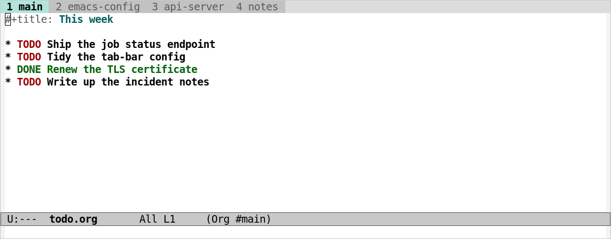
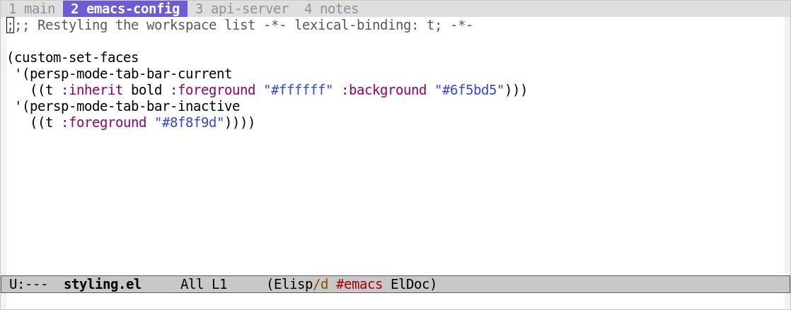

# persp-mode-tab-bar

[](https://github.com/Jotham-LEC/persp-mode-tab-bar/actions/workflows/ci.yml)
[](https://github.com/Jotham-LEC/persp-mode-tab-bar/blob/main/LICENSE)

> A tab bar for [persp-mode](https://github.com/Bad-ptr/persp-mode.el) workspaces.
> Works with Doom Emacs's `+workspace` commands and with plain persp-mode.

It's for people already on persp-mode, most of all through Doom's `:ui workspaces`. persp-mode only tells you which workspace you're in by echoing the list when you switch, and I wanted to see it all the time, so this puts the list in the tab bar.



## Install

Not on MELPA yet. With `use-package` and Emacs 30's `:vc`:

```elisp
(use-package persp-mode-tab-bar
  :vc (:url "https://github.com/Jotham-LEC/persp-mode-tab-bar" :rev :newest)
  :hook (persp-mode . (lambda () (persp-mode-tab-bar-mode (if persp-mode 1 -1)))))
```

Or with [straight.el](https://github.com/radian-software/straight.el):

```elisp
(straight-use-package
 '(persp-mode-tab-bar :type git :host github :repo "Jotham-LEC/persp-mode-tab-bar"))
```

Or Doom, in `packages.el`:

```elisp
(package! persp-mode-tab-bar
  :recipe (:host github :repo "Jotham-LEC/persp-mode-tab-bar"))
```

Emacs 29.1 or newer, and persp-mode 3.0.8 or newer.

## Use

```elisp
(persp-mode-tab-bar-mode 1)
```

In Doom, where `:ui workspaces` gives you persp-mode already, the mode detects the `+workspace` commands and uses them, so the numbering and the order match what `SPC TAB .` displays. It also silences Doom's echoed workspace list, since the bar is now saying the same thing permanently. Set `persp-mode-tab-bar-silence-doom-echo` to `nil` if you want both. Doom's `:ui tabs` is centaur-tabs, which tabs buffers — the two do not overlap.

One Doom side effect: `:ui workspaces` hangs its tab-bar integration off `tab-bar-mode-hook` (`modules/ui/workspaces/config.el`), so turning on the tab bar, which this mode does, also turns on Doom saving each workspace's real tabs when you leave it and restoring them when you come back, and writing them to the session file. It's harmless, since the tabs aren't drawn, but it's why a workspace can come back with tabs you can't see.

## Customising

| Face                          | Default                           | Draws                    |
| ----------------------------- | --------------------------------- | ------------------------ |
| `persp-mode-tab-bar-current`  | `bold` + `highlight`              | the workspace you are in |
| `persp-mode-tab-bar-inactive` | `shadow` + `tab-bar-tab-inactive` | every other workspace    |

Both defaults are compositions of stock faces, so the list follows whatever theme you load. To override, set them the way you set any other face — `custom-set-faces`, or `:custom-face` in a `use-package` block, or `M-x customize-face`:

```elisp
(custom-set-faces
 '(persp-mode-tab-bar-current
   ((t :inherit bold :foreground "#ffffff" :background "#6f5bd5")))
 '(persp-mode-tab-bar-inactive
   ((t :foreground "#8f8f9d"))))

(setq tab-bar-separator "  ")
```



The spacing around a name is the tab bar's, not this package's: `tab-bar-separator` sets what goes between the items, and on a GUI frame a `:box` on either face pads and outlines them.

| Variable                               | Default                   | Does                                                                         |
| -------------------------------------- | ------------------------- | ---------------------------------------------------------------------------- |
| `persp-mode-tab-bar-backend`           | `auto`                    | pins the workspace API — `doom` or `persp-mode` — instead of detecting it    |
| `persp-mode-tab-bar-replace`           | the tab items and the `+` | which `tab-bar-format` items the workspace list stands in for                |
| `persp-mode-tab-bar-silence-doom-echo` | `t`                       | drops Doom's echoed workspace list, which the bar is now showing permanently |

## Compatibility

The mode contributes one `tab-bar-format` item rather than taking the bar. It splices the workspace list in where the real tabs were and leaves every other item where it found it, so history buttons, `tab-bar-format-global` and packages like [tab-bar-echo-area](https://github.com/fritzgrabo/tab-bar-echo-area) or [tab-bar-notch](https://github.com/jdtsmith/tab-bar-notch) go on working; turning the mode off puts the format back, and `tab-bar-show` with it, keeping whatever other packages added or removed while it was on. Its own two faces leave themes and [vim-tab-bar](https://github.com/jamescherti/vim-tab-bar.el) alone, and its `workspace-N` item keys collide with none of Emacs's. Real tab-bar tabs, Doom's per-workspace tab sets included, keep working — they are simply not drawn.

One thing it can't fix: right-clicking a workspace brings up the tab bar's own context menu, with "New tab" and "Reopen closed tab" in it, and both make a real tab you then can't see. That menu is bound once for the whole bar in `tab-bar-map` and decides what to offer from the item's key, so there is no way to give these items a menu of their own.

## Alternatives

If you're not on persp-mode already, one of these probably suits you better.

- **tab-bar with project.el**, both built in. Each tab is a window layout, and `C-x t p` opens a project in a new tab. Every tab sees every buffer, though.
- **[tabspaces](https://github.com/mclear-tools/tabspaces)** builds workspaces on tab-bar and project.el, with a buffer list per tab.
- **[perspective.el](https://github.com/nex3/perspective-el)** is a different package from persp-mode, with the same idea of per-workspace buffer lists.
- **[activities.el](https://github.com/alphapapa/activities.el)** and **[burly](https://github.com/alphapapa/burly.el)** save and restore window layouts and their buffers, rather than keeping workspaces alive; activities.el can give each one a tab.
- **[bufler](https://github.com/alphapapa/bufler.el)** groups buffers by rules (project, mode, directory) and makes workspaces out of the groups.

## Contributing

It is a small package and a personal one. Bug reports and pull requests are welcome.

```sh
make deps    # persp-mode, package-lint and relint, into ./.deps
make check   # byte-compile clean, checkdoc, package-lint, relint, format check, ERT
make format  # indent as plain emacs -Q does
```

CI runs the same on Emacs 29, 30, 31 and snapshot, runs it against persp-mode 3.0.8, the oldest it supports, and runs [melpazoid](https://github.com/riscy/melpazoid). To test against a persp-mode checkout of your own:

```sh
make check PERSP_MODE_DIR=../persp-mode.el
```

[CONTRIBUTING.md](CONTRIBUTING.md) has the rest.

## License

GPL-3.0-or-later.
